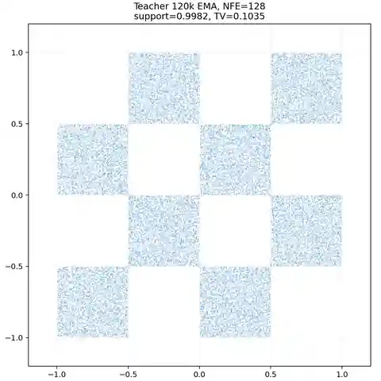
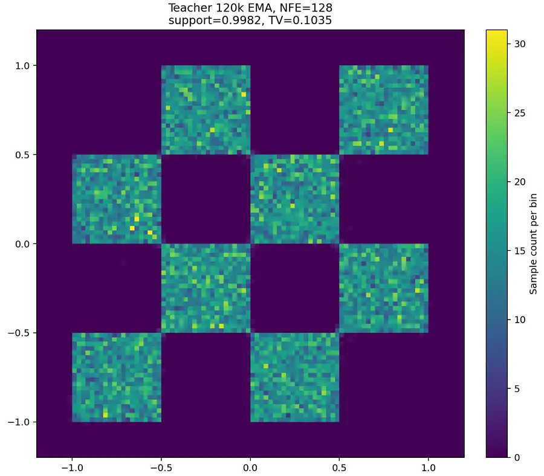
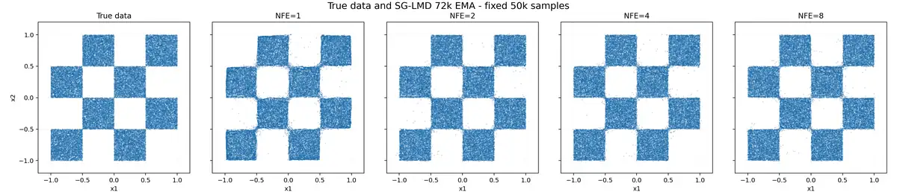
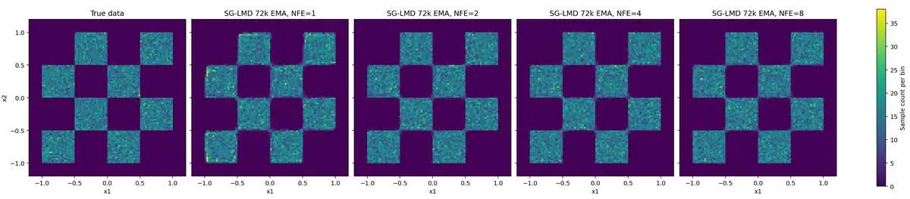
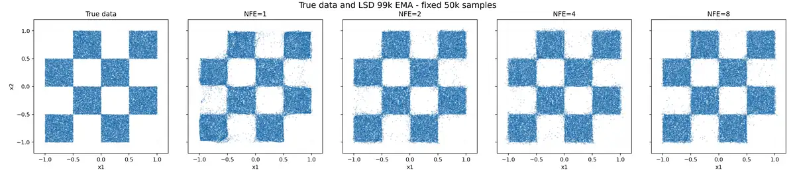

# Flow Maps: 2D Toy Experiments

A compact PyTorch study of flow matching, teacher distillation, and
self-distillation on a two-dimensional checkerboard distribution.

The project follows the flow-map viewpoint described in
[Generative modelling in latent space: Flow Maps](https://sander.ai/2026/05/06/flow-maps.html)
and implements three stages:

1. A Flow Matching teacher trained as an instantaneous velocity field.
2. Stop-gradient Lagrangian Map Distillation (SG-LMD) from the frozen teacher.
3. Lagrangian self-distillation (LSD) without a frozen teacher.

The code is intentionally small enough to inspect end to end. It includes
deterministic checkpoint recovery, checkpoint selection, distribution metrics,
and tests for the flow-map identities and JVP-based objectives.

## Problem setup

The target distribution is a 4 x 4 checkerboard on `[-1, 1]^2`, with eight
occupied cells. Time runs from data at `t=0` to Gaussian noise at `t=1`.

The flow map is parameterized by an average velocity:

```text
F_theta(x, s, t) = x + (t - s) V_theta(x, s, t),
```

where `0 <= t <= s <= 1`. Generation starts from Gaussian noise and evaluates
`F_theta(epsilon, 1, 0)`, either in one call or over multiple equal time
segments.

## Results

The reported checkpoints were selected using fixed evaluation data. Lower SW2,
histogram TV, and histogram JSD are better; higher in-support rate is better.

### Flow Matching teacher

The selected teacher is the 120k-step EMA model evaluated with Euler
integration at NFE=128.

| Step | NFE | In-support | Histogram TV | Histogram JSD |
| ---: | ---: | ---: | ---: | ---: |
| 120k | 128 | 0.99858 | 0.10465 | 0.00919 |

**Sample-space view.** The scatter plot compares the true checkerboard with
50k samples generated by the teacher. It makes support leakage, missing cells,
and geometric distortion directly visible.



**Density view.** The 96 x 96 histogram uses the same linear color range for
the reference and generated panels. It complements the scatter plot by showing
within-cell density variation and boundary concentration.



### SG-LMD

The selected SG-LMD model is the EMA from step 72k. Each row uses 50k generated
samples and the same evaluation reference.

| NFE | SW2 | In-support | Histogram TV | Histogram JSD |
| ---: | ---: | ---: | ---: | ---: |
| 1 | 0.004620 | 0.98648 | 0.12862 | 0.01814 |
| 2 | 0.004374 | 0.98856 | 0.11111 | 0.01300 |
| 4 | 0.004194 | 0.98906 | 0.10946 | 0.01268 |

**Sample-space view.** The scatter panels compare the reference distribution
with SG-LMD sampling at NFE=1, 2, 4, and 8. They show how additional flow-map
segments affect support alignment and the shape of each occupied cell.



**Density view.** The corresponding histograms share a single linear color
scale across all panels. This makes density imbalance and local concentration
comparable across NFE values without per-panel rescaling.



### Lagrangian self-distillation

The selected LSD checkpoint is step 99k. The table reports means over seeds
`20260614`, `20260615`, and `20260616`, with 50k generated samples per seed.

| NFE | SW2 | In-support | Histogram TV | Histogram JSD |
| ---: | ---: | ---: | ---: | ---: |
| 1 | 0.005009 | 0.96221 | 0.14852 | 0.03025 |
| 2 | 0.003869 | 0.96366 | 0.13192 | 0.02386 |
| 4 | 0.003798 | 0.95953 | 0.13229 | 0.02485 |
| 8 | 0.003720 | 0.96940 | 0.12477 | 0.02077 |

**Sample-space view.** The scatter panels show the selected self-distilled
model at NFE=1, 2, 4, and 8 using a fixed evaluation seed. They reveal the
tradeoff between one-step generation and the improved support alignment
obtained from segmented sampling.



**Density view.** The matched histograms use shared bins and a shared linear
color range. They expose differences in cell occupancy and within-cell
uniformity that can be difficult to judge from overlapping scatter points.


The JSON files under `outputs/` contain the complete selection and robustness
results. Training checkpoints and compact model weights are intentionally not
stored in Git.

## Repository layout

```text
.
├── common.py                 # Seeding, EMA, devices, and checkpoint helpers
├── dataset.py                # Checkerboard sampler
├── metrics.py                # Support and distribution metrics
├── models.py                 # Shared FlowMapNet architecture
├── sampling.py               # Teacher and flow-map samplers
├── teacher_code/
│   ├── train_teacher.py
│   └── run_teacher_tmux.sh
├── lmd_code/
│   ├── distill_lmd.py
│   ├── fine_search_lmd.py
│   ├── run_lmd_tmux.sh
│   └── test_lmd.py
├── lsd_code/
│   ├── distill_lsd.py
│   ├── fine_search_lsd.py
│   ├── run_lsd_tmux.sh
│   └── test_lsd.py
├── outputs/                  # Published metrics and figures
├── EXPERIMENTS.md            # English experiment and evaluation notes
└── 方案.md                    # Original detailed research log in Chinese
```

## Installation

Python 3.10 or newer is recommended. The recorded experiments used Python
3.11, PyTorch 2.12, NumPy 2.4, and CUDA 13.0.

Create and activate an environment, then install the dependencies:

```bash
python -m venv .venv
source .venv/bin/activate
python -m pip install --upgrade pip
python -m pip install -r requirements.txt
```

For a CUDA-specific PyTorch build, install PyTorch using the command generated
by the [official installation selector](https://pytorch.org/get-started/locally/)
before installing the remaining requirements.

## Tests

Run the complete CPU-compatible test suite from the repository root:

```bash
python -m unittest discover -s . -p "test_*.py"
```

CUDA-only recovery checks are skipped automatically when CUDA is unavailable.

## Running the experiments

The default configurations reproduce the full experiments and can require
substantial GPU memory and runtime. Use smaller batch sizes and step counts for
smoke tests.

Train the Flow Matching teacher:

```bash
python teacher_code/train_teacher.py --resume auto
```

Train SG-LMD after the teacher has produced
`outputs/teacher/teacher.pt`:

```bash
python lmd_code/distill_lmd.py --resume auto
```

Select the SG-LMD checkpoint:

```bash
python lmd_code/fine_search_lmd.py --checkpoint-dir outputs/lmd
```

Train the self-distilled model:

```bash
python lsd_code/distill_lsd.py --resume auto
```

Select the LSD checkpoint and generate final metrics and figures:

```bash
python lsd_code/fine_search_lsd.py --checkpoint-dir outputs/lsd
```

Each training program accepts `--device`, `--batch-size`, `--steps`, and
output-related options. The two distillation programs also accept
`--microbatch-size`. Run a program with `--help` for the complete interface.

### tmux launchers

The shell launchers run the same programs in named tmux sessions. They use the
active `python` executable by default. Set `FLOW_MAPS_PYTHON` when a specific
environment interpreter is required:

```bash
FLOW_MAPS_PYTHON=/path/to/env/bin/python bash teacher_code/run_teacher_tmux.sh
FLOW_MAPS_PYTHON=/path/to/env/bin/python bash lmd_code/run_lmd_tmux.sh
FLOW_MAPS_PYTHON=/path/to/env/bin/python bash lsd_code/run_lsd_tmux.sh
```

The LMD and LSD launchers first run a 2k-step pilot when no pilot summary is
present, require the pilot checks to pass, and then resume the full run.

## Checkpoints and releases

All `*.pt` files are excluded from Git to keep repository history small. A
GitHub release should attach the compact weights:

```text
outputs/teacher/teacher.pt
outputs/lmd/best_lmd_sg.pt
outputs/lsd/best_lsd.pt
```

Full training checkpoints contain optimizer state and random generator state.
Publish only selected recovery checkpoints when exact training continuation is
important; keep routine intermediate checkpoints outside the repository.

## References

- [Flow Matching for Generative Modeling](https://arxiv.org/abs/2210.02747)
- [Flow Map Matching](https://arxiv.org/abs/2406.07507)
- [Learning flow maps via self-distillation](https://arxiv.org/abs/2505.18825)
- [Official flow-maps implementation](https://github.com/nmboffi/flow-maps)

## License

This project is released under the MIT License. See [LICENSE](LICENSE).
